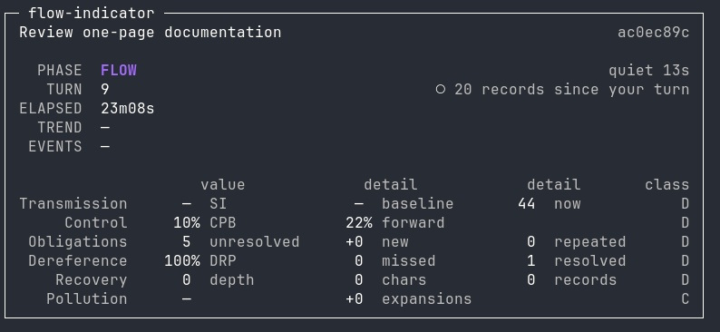
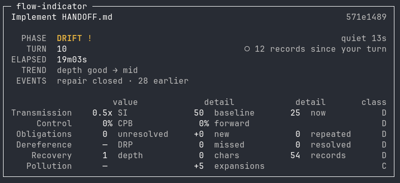

# flow-indicator

[pate.sh](https://pate.sh) | [provenance](https://tgp.ski) | [commands](docs/COMMANDS.md) | [herdr](docs/HERDR.md) | [integrations](docs/INTEGRATIONS.md) | [profiles](docs/PROFILES.md) | [inference](docs/INFERENCE.md) | [calibration](docs/CALIBRATION.md) | [events](docs/EVENTS.md) | [metrics](docs/METRICS.md)

A local meter for when cheap agent steering gives way to repeated correction,
constraint restatement, repair, and operator serialization.

It answers one question about an interaction stream:

> Is the operator advancing the work, or spending increasing effort keeping the
> agent aligned with work already established?

Stdlib-only Go, one binary.

## What it reads

An ordered stream of interaction records, through a harness:

| harness | input |
|---|---|
| `claude-code` | a Claude Code session file, `~/.claude/projects/<project>/<session>.jsonl` |
| `codex` | a Codex rollout, `~/.codex/sessions/YYYY/MM/DD/rollout-*.jsonl` |
| `opencode` | a session in opencode's SQLite store, `<db-path>#<session-id>` |
| `qwen` | a Qwen Code session file, `~/.qwen/projects/<project>/chats/<session>.jsonl` |
| `generic` | JSONL with at least `stream_id`, `seq`, `speaker`, `text` |

Each harness owns every field name of its own format. No other package reads
them. Replay and the live meter take the same names, so anything that can be
replayed can be watched.

## What it writes

Per stream, under `$XDG_DATA_HOME/flow-indicator/sessions/<stream-id>/`:

| file | role |
|---|---|
| `observations.jsonl` | append-only, observed events |
| `classifications.jsonl` | append-only, classifier candidates |
| `obligations.jsonl` | append-only, obligation transitions |
| `repairs.jsonl` | append-only, repair episode transitions |
| `metrics.jsonl` | append-only, derived metrics, regime and epoch changes |
| `source.json` | source path, byte offset, record count |
| `summary.json`, `metrics.json`, `report.md`, `timeline.csv` | projections, rebuilt from the events above |

The five `.jsonl` files are the source of truth and are never rewritten. A
changed interpretation appends another event. Everything else is disposable.

By default the stored text is a 160-character snippet per record, not the
transcript. `privacy.store_text` and `privacy.store_snippets` control this.

## Quick start

```bash
go install github.com/TGPSKI/flow-indicator/cmd/flow-indicator@latest
```

Or from a clone, which stamps the build with its version and commit:

```bash
make install          # into GOBIN
make build            # ./flow-indicator, statically linked
flow-indicator version
```

Go 1.26, no other build dependency.

```bash
# What is on this machine, across every harness.
flow-indicator sessions

# Follow one.
flow-indicator watch --last
```

`flow-indicator help <command>` prints one command's flags.
[docs/COMMANDS.md](docs/COMMANDS.md) adds when to reach for each.

## Live instance read-back

Each running `watch` on a discovered session writes one local operational record beside the
session directory. It contains liveness coordinates and a small derived metric
subset, never transcript text or event data. Other local tools read it only
through the public command:

```text
flow-indicator instances --json
```

An empty list is a successful observation that no local watches are live. A
stale record is excluded after its process and TTL probe; it is not treated as
a stopped interaction.

`sessions` prints the agent sessions it found, newest first, with a handle short
enough to retype:

```text
WHEN     HARNESS      SESSION     PROJECT
now      codex        019ffd5a    ~/src/parser
now      claude-code  c0d33334    ~/src/flow-indicator
5m ago   opencode     ses_002a9   ~/src/parser
```

Nothing there has to be looked up first. Codex names its rollouts after a UUID
under a dated directory and opencode keeps no files at all, so the handle in
that table is the whole interface:

```bash
flow-indicator watch 019ffd5a       # a Codex rollout
flow-indicator watch ses_002a9      # a session inside opencode's SQLite store
```

Any prefix long enough to be unique works. Naming a file still works too:

```bash
# Replay a fixture.
flow-indicator replay --adapter generic fixtures/recent-thrash/input.jsonl

# Replay a session from any harness.
flow-indicator replay --adapter codex ~/.codex/sessions/2026/08/13/rollout-*.jsonl
```

Replay prints one line and the session directory:

```text
RECOVERY SI 4.8x    warn CPB 58%   OBL 12  DRP 67%    REPAIR depth 1
```

## Watch a live session

```bash
cd ~/your/project        # the directory the agent session is running in
flow-indicator watch --current
```

`--current` finds the session recorded for this working directory, prints which
one it picked, replays it from the beginning to build state, and then follows
it. It asks every harness, so it finds a Codex or opencode session as readily as
a Claude Code one; pass `--adapter` to search only one. `--last` skips the
directory question entirely and follows the most recently written session on the
machine, which is what a pane wants when the shell is not sitting in the project.

Selection reads the working directory the source itself
records, not the encoded project directory name; subagent transcripts are
skipped; among several sessions for one directory the most recently modified
wins. If two were written within two seconds of each other, it prints the
candidates and exits rather than guess. If none match, it says so and does not
reach into another project.

Under herdr, `--pane` selects by pane instead of directory, which is the
disambiguation `--current` cannot make: two agents working in one directory
are two panes.

```bash
flow-indicator watch --pane auto     # the agent pane sharing this pane's tab
flow-indicator watch --pane w1W:p1   # a named pane
```

`auto` asks herdr which pane this process runs in and picks the agent pane in
the same tab, widening to the workspace when the tab has none; two candidates
are printed as `--pane` choices, never guessed. The pane's session is herdr's
own join, uniformly for every agent: each installed herdr integration reports
its agent's session id into the daemon, one field answers for claude, codex,
opencode and qwen alike, and no agent-specific scraping exists to rot. The pane
and the chosen session are printed before the watch starts. Resolution reads
herdr and the session stores; it never acts on the pane.

The watch is keyed to the pane, not to the first session it resolved: every
five seconds the pane is re-resolved, and a positive resolution to a
different session — an agent restart — ends the current observation and
follows the new session from its beginning. Resolution errors and the empty
gap between an agent exiting and its replacement starting change nothing; a
quiet pane and a restarting one look alike from outside, so only a new id
acts.

A pane whose integration has not reported its session yet is waited on, not
failed: the meter prints what it is waiting for and locks on when the
report lands. Only a pane that cannot be followed at all — no such pane,
ambiguity, a missing command — exits.

The meter does not need a pane of its own. `--herdr-pane <id|auto>` pushes four
display tokens — phase, turn, elapsed, trend — into that pane's herdr sidebar
row, each carrying a 30-second TTL refreshed every 10 seconds. herdr draws that
row only for a pane it has promoted to an agent; `--herdr-workspace <id|auto>`
pushes the same tokens onto a workspace's space row, which every workspace has.
`auto` is the agent pane sharing this tab for the pane form, and this process's
own workspace for the workspace form:

```bash
flow-indicator watch --pane auto --herdr-pane auto
flow-indicator watch --current --herdr-workspace auto
```

The push is one bounded subprocess that never blocks the draw loop, and a failed
push is ignored: herdr may not be running, and a meter that cannot draw a
sidebar row is still a meter. If this process dies the row expires rather than
showing a phase that stopped being true. It reads no herdr state, changes no
pane, and touches no server lifecycle. The tokens render only where herdr's
sidebar config names them; the one config block that is needed is in
[docs/HERDR.md](docs/HERDR.md).

Pane resolution, restart following, the token contract and the layouts are in
[docs/HERDR.md](docs/HERDR.md).

Bootstrap is a read of the source, not a copy of it. On a 6.5 MB session it
takes about 0.2 s, on a 20 MB session about 0.4 s. `--tail-only` skips it and
follows from the end, with the earlier turns absent from the state.

The default view is the side-pane meter, three to eight lines wide enough for a
30-column pane:

```text
FLOW ·                          DRIFT !
SI 1.2x  CPB 9%  ctl 0/8        SI ?  CPB 18%  ctl 3/8
repair —                        repair —
                                3 interrupts within 8 turns
                                F → D
```

The regime word comes first and a glyph repeats the severity, so a terminal that
drops attributes loses nothing. An unknown metric prints `?`, never `0`. The
reason line names the rule that actually fired, read from the decision the
projector recorded — not re-derived from the numbers beside it. `--no-color`
and `NO_COLOR` are honoured, `--width` sets the pane width.

Naming a session works too, and is the path for anything that is not the current
one. An identifier from `flow-indicator sessions` is enough; it carries its own
harness, so there is no path to find and no `--adapter` to pick:

```bash
flow-indicator watch 019ffd5a
```

A file still works, and takes `--adapter` when it is not one discovery already
knows:

```bash
flow-indicator watch --adapter codex ~/.codex/sessions/2026/08/13/rollout-*.jsonl
flow-indicator watch --adapter opencode ~/.local/share/opencode/opencode.db#ses_abc123
```

A session named by identifier is replayed from its beginning, like `--current`.
A bare path starts at the end instead: `--from-start` reads the whole thing
first, `--offset N` starts at a byte offset. It is a start point, not a resume —
state is built from that point forward.

The file-backed harnesses follow growth by tailing bytes, hold a partial final
record until its newline arrives, and never write to the file they follow.
opencode has no file to tail — its transcript is rows, and the newest message
grows in place while the agent streams into it — so it is followed by re-query,
and the agent's newest message is held back until it is finished. A record the
projector has consumed cannot be amended, so releasing a half-written turn would
freeze it that way.

`Ctrl-C` records that observation stopped, where it reached, and with what left
open, then writes the projections. It draws no conclusion about the interaction:
a repair that was open stays open.

Piped input works for the harnesses whose transcript is a byte stream:

```bash
some_stream | ./flow-indicator watch --adapter generic
```

`--full` draws the audit view instead: one screen with every metric family and
its evidence class.





```text
┌─ flow-indicator ─────────────────────────────────────────────┐
│ session recent-thrash   turn 23   regime RECOVERY            │
│                                                              │
│ TRANSMISSION   SI 4.8x      baseline 58  now 277   warn    D │
│ CONTROL        CPB 58%      forward 37%                    D │
│ OBLIGATIONS    12 unresolved  +4 new  1 repeated           D │
│ DEREFERENCE    DRP 67%     2 missed / 4 resolved           D*│
│ RECOVERY       depth 1     277 chars   1 records           D │
│ POLLUTION      unknown     +0 expansions                   C │
└──────────────────────────────────────────────────────────────┘
```

`O` observed, `C` classified, `D` derived. `*` marks the dereference proxy.

`OBLIGATIONS` counts obligation candidates the operator stated that nothing has
resolved since. It is an inventory, not a count of requirements known to remain
in force. The count goes down when the operator withdraws a requirement, and
back up if they state it again; it never claims the rest are still in force.

Which resolutions are reachable depends on the classifier, and each snapshot
records what its own could establish. The default marker tier establishes
operator release. Supersession and satisfaction need a semantic classifier, and
a build without one says so rather than reporting a zero that was never
measured.

## Harnesses

One interface, four coding agents. A session from any of them decodes into the
same canonical records, so every rule, metric and calibration works across all
four without being told which produced it.

| Harness | Store | Notes |
|---|---|---|
| `claude-code` | `~/.claude/projects/<project>/*.jsonl` | Sub-agent streams marked in-stream |
| `codex` | `~/.codex/sessions/YYYY/MM/DD/rollout-*.jsonl` | `CODEX_HOME` honoured; sub-agent threads are sibling files |
| `opencode` | `~/.local/share/opencode/opencode.db` | SQLite, read through `sqlite3` in read-only mode |
| `qwen` | `~/.qwen/projects/<project>/chats/*.jsonl` | Sub-agent streams under a sibling `subagents/` directory |
| `generic` | any directory of neutral JSONL | The format the fixtures are written in |

```bash
flow-indicator replay --adapter codex ~/.codex/sessions/2026/08/13/rollout-*.jsonl
flow-indicator replay --adapter opencode ~/.local/share/opencode/opencode.db#ses_abc123
flow-indicator corpus --harness codex          # survey; takes nothing
```

Every harness tool name lives inside that harness's own file. A rule that named
one would inherit its vocabulary, and a test fails the build if one escapes.

Two asymmetries worth knowing before comparing harnesses:

- **Codex has no read, grep or glob tool.** It reads files by running programs,
  so its verb histogram is nearly all `execute` where another harness would show
  `read` and `search`. Nothing here pretends otherwise.
- **opencode needs `sqlite3` on PATH.** This program carries no database driver,
  and a pure-Go SQLite engine would be the largest thing in it. The connection
  is read-only and WAL-aware, so a running opencode is neither disturbed nor
  read stale.

Every boundary this program has with something outside its own process — the
session stores, `sqlite3`, herdr, the instance records, the classifier endpoint
— is listed in [docs/INTEGRATIONS.md](docs/INTEGRATIONS.md).

## Profiles

The classified families are made of two kinds of rule, and only one should ever
be tuned.

**Structural rules are universal** and stay in code with no dial: whether a
sentence has a subject before its marker, whether it sits inside a fence,
whether the agent re-edited a path it had just written, whether a write landed
outside what the correction named.

**The lexicon is not universal.** Which words a person reaches for when they
correct, stop or constrain varies by operator, team, language and domain. That
is what a profile holds, and all it holds.

A baseline ships in the binary. An operator overlay at
`$XDG_CONFIG_HOME/flow-indicator/profile.json`, or one named with `--profile`, is
merged over it — adding to the marker groups rather than replacing them, unless
it asks to replace:

```json
{
  "name": "my-team",
  "markers": {
    "correction_tier1": {"phrases": ["nah", "back up"], "anchored": ["hold on"]},
    "release":          {"phrases": ["belay that"]}
  },
  "parameters":     {"bulk_paste_lines": 60},
  "discriminators": {"code_density": false}
}
```

An overlay changes the classifier's hash, so a session classified under one is
never mistaken for one classified under the baseline.

The overlay is resolved from the directory of the configuration file in use, and
every tier reads the same ruleset. Group semantics, merge rules, the parameter
and discriminator tables and the provenance consequences are in
[docs/PROFILES.md](docs/PROFILES.md).

## Calibrate against labels

The classified families are calibrated against labeled sessions, not tuned until
the numbers look right. A codebook states the unit, the decision rule and the
boundary cases per family, and every change to a classified family is registered
before it is made with the result that would falsify it. Both hold operator
transcripts and are not distributed; `docs/METRICS.md` carries the decisions
that came out of them, and [docs/CALIBRATION.md](docs/CALIBRATION.md) carries
the loop itself and what it has measured.

```bash
# Survey a directory of sessions; take nothing.
flow-indicator corpus --scan ~/.claude/projects

# Seal the selected ones into a manifest, split dev/holdout.
flow-indicator corpus --scan ~/.claude/projects --build --out corpus/

# Emit units for a labeler. Source text, no verdict.
flow-indicator label --manifest corpus/manifest.json --family obligation \
  --sample-per-mille 150 > units.jsonl

# Or have a model fill them in: two passes per family, differing in order and
# wording, so their agreement measures the codebook rather than the sampler.
flow-indicator annotate --manifest corpus/manifest.json --out labels-model/ \
  --endpoint http://127.0.0.1:8000/v1/chat/completions --model your-local-model

# Score the rules against the filled-in labels.
flow-indicator calibrate --labels labels/ --manifest corpus/manifest.json --split dev
```

A model judgement is not ground truth. `annotate` writes candidates an
adjudicator accepts or rejects, and each file names the model that produced it,
so a score can say what judged the corpus. A pass that collapses to one class is
called out as measuring nothing.

By default the corpus references sessions where they lie and seals them by hash;
`corpus --copy` copies them under the output directory instead. The split is a
function of each session's identifier, stratified by project, so nobody chooses
which sessions the holdout gets.

Every run prints the artifact, corpus manifest, rule and label-set hashes it ran
under, and every score is printed with its operator-facing consequence beside it
— "the inventory is inflated 3.1x", "one repair episode in four was seen". A
score that improves while that does not is a score measuring the harness.

The split is by session, never by turn: turns inside a session are not
independent. Opening the holdout requires a stated reason and is recorded.

## Read a result

```bash
./flow-indicator report  --session recent-thrash
./flow-indicator inspect --session recent-thrash --turn 19
./flow-indicator inspect --session recent-thrash --turn 19 --micro
```

`report` renders markdown from the stored events. `inspect` is source
drilldown: it prints one turn's source path, byte offset, record SHA-256,
snippet, observations, classifications, state transitions with the rule and
license that decided each one, and the metrics that turn produced. `--micro`
redraws the side-pane meter as it stood at that turn, from the same renderer
the live path uses.

## Replay many sessions

```bash
./flow-indicator replay-set \
  --adapter claude-code \
  --manifest sessions.txt \
  --output results.jsonl
```

The manifest is one source path per line; blank lines and `#` comments are
ignored. Each session produces one JSONL row — counts, regimes seen, first
transition to each non-FLOW state, extremes — and a second file of anchors: the
source path, sequence number and byte offset of every correction, interruption,
repair opening, thrash transition, the first non-FLOW transition, and the three
highest-inflation turns. Every anchor drills back to source through `inspect`.

It runs the ordinary replay path. It emits no score, no health label, and no
ranking.

## Configuration

`$XDG_CONFIG_HOME/flow-indicator/config.json`, or `~/.config/flow-indicator/config.json`.
Missing file means defaults. An unknown key or an invalid value is an error:
there is no silent fallback.

```json
{
  "window": {
    "rolling_turns": 30,
    "correction_durability_turns": 10,
    "dereference_outcome_turns": 3,
    "trend_durability_turns": 2
  },
  "thresholds": {
    "minimum_control_baseline": 8,
    "thrash_repair_depth": 3,
    "serialization_warn": 3.0,
    "serialization_high": 6.0,
    "repeated_obligations_warn": 2
  },
  "classifier": {
    "mode": "heuristic",
    "endpoint": "",
    "model": "",
    "live_deadline_ms": 200,
    "workers": 1,
    "max_queue": 32
  },
  "privacy": {
    "store_text": false,
    "store_snippets": true,
    "snippet_chars": 160
  }
}
```

Classifier modes: `none` (observations only), `heuristic` (the versioned marker
table in `internal/classify/heuristic.go`), `openai-compatible` (any endpoint
speaking the OpenAI chat completions shape; key from `FLOW_INDICATOR_API_KEY`),
and `hybrid` (heuristics live, bounded local-model work in the background).
Invalid model output is rejected and recorded, never repaired with a second
call. A semantic error retains the safe heuristic result for that record.

`heuristic` is the live default. It reads markers, so it does not reach a
correction that carries no marker — "you broke a lot of stuff", "we have to
start from scratch" — and four sessions in the review corpus fail that way.

`openai-compatible` is the opt-in for that class. Against a local
`qwen36-35b-a3b-nvfp4` it caught one of the two misses the heuristic path leaves
open, and left the healthy controls quiet. It also lost a THRASH the heuristic
path found, opened a repair episode on a pasted document, and took 0.3–0.5 s per
record against the heuristic's whole-session 0.2 s. Turn it on for replay of a
session you want read more closely; leave it off for the live pane.

`hybrid` is the live alternative. It projects the marker tier immediately and
sends eligible turns to a bounded worker pool. The full and micro views show
semantic completion, queueing, failures, drops and latency. Late semantic
results are stored as classified evidence but do not yet revise a live regime;
replay with `openai-compatible` remains the strict semantic path.

```json
{"classifier": {
  "mode": "hybrid",
  "endpoint": "http://127.0.0.1:8000/v1/chat/completions",
  "model": "your-local-model",
  "live_deadline_ms": 200,
  "workers": 1,
  "max_queue": 32
}}
```

See [docs/INFERENCE.md](docs/INFERENCE.md) for what each mode sends, local
versus cloud endpoints, the validation that rejects a bad reply, provenance and
replay semantics.

## What it does not claim

- No claims about hidden model state. It never reports that a model forgot,
  regressed, or was confused. It reports correction density, repeat counts,
  repair depth, serialization inflation, and forward-work share.
- The dereference figure is a **proxy**. It reports what the operator did next,
  not whether a reference resolved.
- Heuristic classification produces **candidates**, not truth. Every
  classification carries its classifier name, version and rule-table hash.
- Where evidence does not support a value, the value is `unknown`. Unknown is
  never rendered as zero and never satisfies a threshold.
- It is an instrument. It does not intervene, orchestrate, remember across
  sessions, or act on the stream it measures.
- The classified families are **not calibrated against ground truth**. Scoring
  runs exist against model-produced labels — two passes per family under
  differing instructions — and three of the four families still agree with
  themselves too weakly to be scored against. `obligation` is the exception:
  precise, and missing most of what the operator asked for, because the marker
  table is the ceiling. No model label is promoted to ground truth and no rule
  has been changed on the strength of one. The run history, the kappa per
  family and what each failure turned out to be is in
  [docs/CALIBRATION.md](docs/CALIBRATION.md); every rule in the classified
  families remains a stated hypothesis with a recorded falsifier.

## Repository layout

```text
cmd/flow-indicator/   the one binary: watch, instances, sessions, replay,
                      replay-set, report, inspect, corpus, label, annotate,
                      calibrate
internal/stream/      canonical record, action vocabulary, normalization, tail
internal/adapter/     one decoder per record format: generic, claude-code, qwen
internal/harness/     session discovery, decoding and live following per agent
internal/observe/     deterministic counts over record text
internal/classify/    marker classifier, model classifier, hybrid worker lane
internal/profile/     shipped baseline lexicon and operator overlay
internal/event/       the event envelope and kinds
internal/state/       obligations, repair episodes, regime, projector
internal/metrics/     the six metric families
internal/config/      operator-tunable windows, thresholds, privacy
internal/store/       append-only JSONL and session layout
internal/render/      report, inspect, live view
internal/labeler/     model-backed candidate labeling
internal/labels/      ground truth, alignment by span, scoring, Cohen's kappa
internal/calibrate/   corpus manifest, replay for scoring, run records
pkg/panel/            the terminal layer, stdlib-only, reusable
fixtures/             five frozen fixtures with expectations
docs/                 COMMANDS.md, HERDR.md, INTEGRATIONS.md, PROFILES.md,
                      EVENTS.md, METRICS.md, INFERENCE.md, CALIBRATION.md
```

## Development

```bash
make check   # gofmt, go vet, go mod verify
make test    # go test ./...
make ci      # check + test-race + lint
```

## Contributing

See [CONTRIBUTING.md](CONTRIBUTING.md).

## License

GPL-3.0. See [LICENSE](LICENSE).
